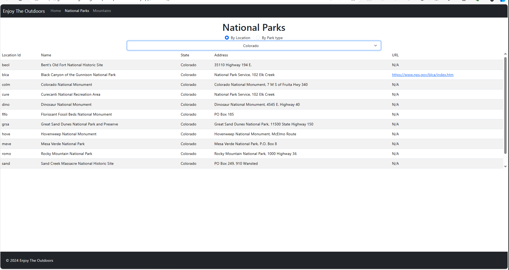
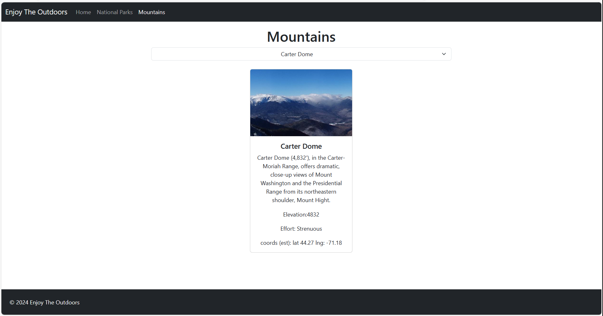

# Enjoy the Outdoors

## Project Description

Enjoy the Outdoors is a web application designed to help users find national parks to enjoy and mountains to climb. It provides an intuitive interface for searching national parks by location or park type and exploring information about various mountains.

## Live Demo

Check out the live demo of the project [here](https://give-me-a-good-grade-plz-capstone-2.netlify.app).

### National Parks Search Page

- **Search by Location:** Allows users to select a state/territory from a dropdown to find matching national parks.
- **Search by Park Type:** Enables users to select a park type from a dropdown to find national parks that match the description.
- **View All National Parks:** Option to view all national parks.
- **Visit Links:** Some parks have a "Visit" property with a URL, allowing users to visit the park's page.

### Mountains Information Page

- **Dropdown Selection:** Users can select a mountain from a dropdown list of 48 mountains.
- **Mountain Details:** Displays the mountain name, description, elevation, and other interesting information.

## Stretch Goals Implemented

- Display images of the mountains along with their details.
- Convert and display sunrise and sunset times in the local time zone.

## Installation

To run this project locally:

1. Clone the repository:
   ```bash
   git clone https://github.com/your-username/enjoy-the-outdoors.git
   ```

## screenshots




